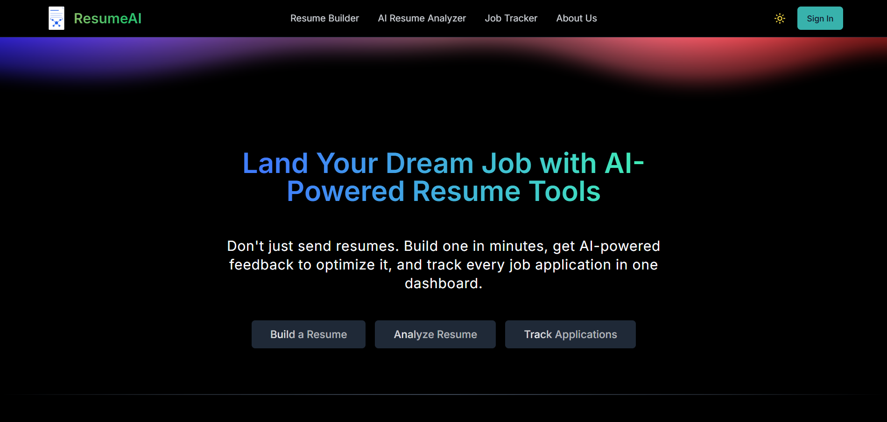

<!-- GitHub Profile README -->

<h1 align="center">Hi, I'm Rahul Kumar Mall</h1>
  

---

<table width="100%">
  <tr>
    <td valign="top" width="50%">
      
  <h2 align="center">About Me</h2>

  - 2+ years of experience in building full stack web apps using **React, Typescript, Tailwind, FastAPI, Flask, Node.js, MongoDB, PostgreSQL, Docker and AWS**
  - Developed agentic workflows using **RAG, Langchain, Embedding Models and Vector Database**
  - [My Portfolio](https://portfolio-website-eight-plum.vercel.app/)
  - Reach me: [rahul1038402@gmail.com](mailto:rahul1038402@gmail.com)

    </td>
    <td valign="top" width="50%">
      
    </td>
  </tr>
</table>

<!-- Animated Divider -->

  

<table width="100%">
  <tr>
    <td valign="top" width="50%">

  <h2 align="center">Building @ResumeAI</h2>

<strong>I've been working on ResumeAI, a web app designed specifically to help college students and freshers who are navigating the job market for the first time.</strong>

<!-- Clickable Image -->

  

<ul>
  <li><strong>Resume Analysis</strong> – Upload your resume and get personalized, actionable suggestions to improve it</li>
  <li><strong>AI Resume Builder</strong> – No resume yet? Just enter your details and generate an ATS-friendly resume from scratch</li>
  <li><strong>Application Tracker</strong> – Keep all your job applications organized in one place</li>
  <li>Got <strong>200+ site visitors</strong> within 2 weeks organically 🙂</li>
  <li>Currently in <strong>Beta Phase</strong>, seeking for users feedbacks for improvements</li>
</ul>

  </td>
  </tr>
</table>

<!-- Animated Divider -->

  

<h2 align="center">Languages & Tools</h2>

<!-- Frontend -->

  <h4>Frontend</h4>
  

<!-- Backend -->

  <h4>Backend</h4>
  

<!-- Database -->

  <h4>Database</h4>
  

<!-- Tools -->

  <h4>Tools</h4>
  

<!-- Animated Divider -->

  

<h2 align="center">Connect with Me</h2>

  
   
  
  
      

